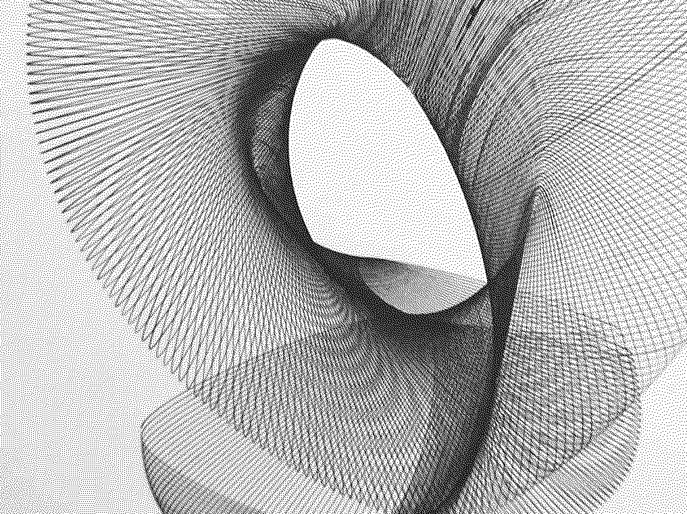

# DitherKt



[Filter.kt](https://codeberg.org/oppen/DitherKt/src/branch/master/src/online/fisk/filters/Filter.kt) - Platform agnostic dithering filters  
[Dither.kt](https://codeberg.org/oppen/DitherKt/src/branch/master/src/online/fisk/Dither.kt) - Desktop implementation

[DitherCL.jar](DitherCL.jar) - Jar download, usage: `java -jar DitherCL.jar`:

```bash
DitherCL - Help
Usage: DitherCL pathToImage filterName
Available filters:
Atkinson
2x2Bayer
3x3Bayer
4x4Bayer
8x8Bayer
5x3Bayer
Burkes
FalseFloydSteinberg
FloydSteinberg
JarvisJudiceNinke
LeftToRightErrorDiffusion
NewspaperHalftone
Random
Sierra
SierraLite
Stucki
Threshold
TwoRowSierra
```

Example with threshold argument (range 1 to 256): `java -jar DitherCL.jar image.png 8x8Bayer 100`
